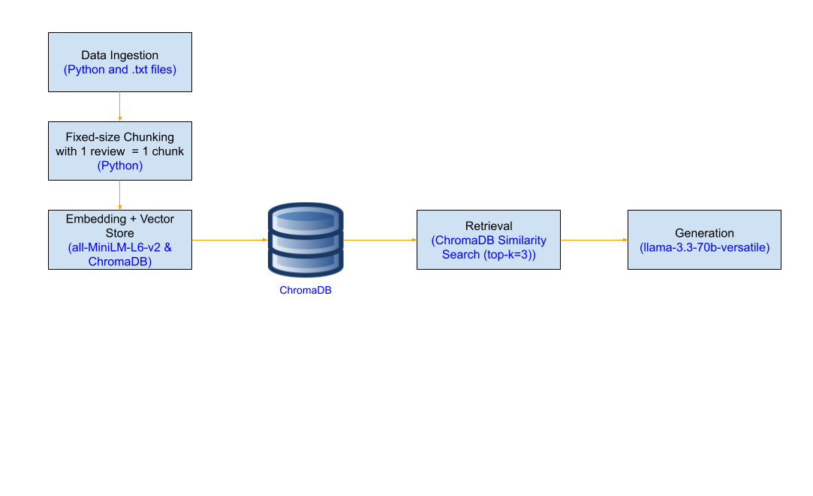

# Project 1 Planning: The Unofficial Guide

> Write this document before you write any pipeline code.
> Your spec and architecture diagram are what you'll use to direct AI tools (Claude, Copilot, etc.) to generate your implementation — the more specific they are, the more useful the generated code will be.
> Update the Retrieval Approach and Chunking Strategy sections if you change your approach during implementation.
> Update this file before starting any stretch features.

---

## Domain

<!-- What domain did you choose? Why is this knowledge valuable and hard to find through official channels? -->
The domain I chose is based on student reviews of different professors in Computer Science at Arizona State University.
This knowledge is valuable and hard to find through official kind of knowledge, which are official university resources do not
highlight real course experience from students based on the teaching style of their professor, workload, exams, grading, and course expectations. 
Real kind of knowledge, like Rate My Professor reviews, uncover the true knowledge or information about a professor and the course under a professor,
along with those other aspects, and this RAG system will make the knowledge from these student reviews searchable so that other students can get
accurate and precise information about professors while getting more grounded answers based on reviews. 
---

## Documents

<!-- List your specific sources: URLs, subreddit names, forum threads, or file descriptions.
     Aim for at least 10 sources that together cover different subtopics or perspectives within your domain. -->

| # | Source | Description | URL or location |
|---|--------|-------------|-----------------|
| 1 | Rate my Professor | Joshua Daymude reviews| https://www.ratemyprofessors.com/professor/2813800 |
| 2 | Rate my Professor | Ryan Meuth reviews | https://www.ratemyprofessors.com/professor/1837088 |
| 3 | Rate my Professor | David Claveau reviews | https://www.ratemyprofessors.com/professor/1674624|
| 4 | Rate my Professor | Ming Zhao reviews| https://www.ratemyprofessors.com/professor/2095554 |
| 5 | Rate my Professor | James Gordon reviews | https://www.ratemyprofessors.com/professor/2844149 |
| 6 | Rate my Professor | Justin Selgrad reviews | http://ratemyprofessors.com/professor/2042001 |
| 7 | Rate my Professor | Farideh Tadayon-Navabi reviews | https://www.ratemyprofessors.com/professor/500103 |
| 8 | Rate my Professor | Xuerong Feng reviews | https://www.ratemyprofessors.com/professor/1167426 |
| 9 | Rate my Professor | Subbarao Kambhampati reviews | https://www.ratemyprofessors.com/professor/1661785 |
| 10| Rate my Professor | Bharatesh Chakravarthi reviews | https://www.ratemyprofessors.com/professor/2920261 |

---

## Chunking Strategy

<!-- How will you split documents into chunks?
     State your chunk size (in tokens or characters), overlap size, and explain why those
     numbers fit the structure of your documents.
     A review-heavy corpus warrants different chunking than a long FAQ. -->

**Chunk size:**
Each document contains 10 reviews for one professor, and each reviews varies in length, roughly between 5-75 words. Each review can be very short and brief or detailed, but not too long in length. Since each review has a different word count and are self-contained, we can treat each review as one chunk so that we can preserve the contents of each student's review about a professor as the reviews can be made by different students.
That being said, each chunk could be around 20-90 tokens. 

**Overlap:**
The overlap size will be set to 0. 

**Reasoning:**
Each student review could be different from other student review within a document, causing reviews to potentially be independent from each other. These reviews could be made from different students, and they may not be related to each other in terms of grading , workload, professor teaching style, and other factors as they could be based on different courses that had different course structures and sometimes students may have different opinions on a professor. For a worse case scenario, it would be recommended to treat each review seperately where in this case, one review would be one chunk. Each review is small in content, which is why we chose the value of chunk size to be around 20-90 tokens, and since we treat each review independently, the overlap would be 0.

---

## Retrieval Approach

<!-- Which embedding model are you using (e.g., all-MiniLM-L6-v2 via sentence-transformers)?
     How many chunks will you retrieve per query (top-k)?
     If you were deploying this for real users and cost wasn't a constraint, what tradeoffs
     would you weigh in choosing a different embedding model — context length, multilingual
     support, accuracy on domain-specific text, latency? -->

**Embedding model:**
I will be using the all-miniLM-L6-v2 via sentence-transfomers. I think this embedded model will be effective for embedding the chunks because we are dealing with chunks of short length. In addition to that, this embedding model is also optimized primarily for semantic chunking where it will find similarities semantically on sentences. 

**Top-k:**
Top-k is set to 3 since it will help us obtain relevant context that is related to our questionand closest in meaning. This prevents loosely related reviews from being retrieved that could affect the response given. 

**Production tradeoff reflection:**
If I were deploying this for real users and cost wasn't a constrain, I would weign in accuracy on domain- specific text and latency. 
For accuracy on domain-specific text, this is a important tradeoff when choosing another embedding model. the one we selected is optimized for semantic chunking on short text and takes up less time, but it could hinder accuracy compared to more complex and larger models. It may not be able to recognize the meaning of different wording whether that's specific terms like slang words or language that could imply the same thing, but uses different wording. If a different embedding model was selected, it would be a more accurate model that could recognize informal text or sentences  involving different wording that imply the same meaning and would also better recognize relationships between different chunks, allowing for more relevant chunks closer in meaning to be retrieved. 
Latency is also relevant because we need to make sure the model is generating quck responses, meaning we would have to reduce latency as efficient as possible. Our embedding model is lightweight and of reasonable size and is able to respond quickly. Choosing a larger, and more accurate model that could also be more complex would improve the process of retrieving more relevant and related chunks close in meaning to a query, but could  take up more time to respond. 

---

## Evaluation Plan

<!-- List your 5 test questions with their expected correct answers.
     Questions should be specific enough that you can judge whether the system's response
     is right or wrong. "What are good dining halls?" is too vague.
     "What do students say about wait times at [dining hall name] during lunch?" is testable. -->

| # | Question | Expected answer |
|---|----------|-----------------|
| 1 | Which professor receives most praise for explaining challenging concepts in a clear manner? | | Joshua Daymude
| 2 | Which professor is frequently described as approachable and supportive, especially when being able to help students outside class?| | James Gordon
| 3 | Which professor receives the most complaints about their curriculum and being difficult with hard or unfair exams?| | Ming Zhao
| 4 | Which professor is most often criticized for their coursework in terms of excessive workload or too much reading or course structure? | | Ryan Meuth
| 5 | Which professor receives the most student reviews that describe any course they taught as both difficult and highly rewarding? | | Subbarao Kambhampati

---

## Anticipated Challenges

<!-- What could go wrong? Name at least two specific risks with reasoning.
     Consider: noisy or inconsistent documents, missing source attribution, off-topic
     retrieval, chunks that split key information across boundaries. -->

1. Chunks that split key iunformation across boundaries-We are using fixed-size chunking where 1 review is treated as one chunk and the reviews are
short with a couple sentences, self-contained, and have consistent format. However using fixed-size chunking could divide a review into multiple chunks,
which could be a problem, especially if a review contains relevant information.  This important information could be seprrated across these multiple chunks,
causing retrieval to only obtain a part of the review and this important information, which can lead to missing context since we do not have all the important
information. This could also cause less accurate responses as the output may look incomplete since we only have some of the important aspects of the review. 

2. Retrieval of Short reviews-There are a good number of chunks based on short reviews that do not contain enough context about various factors for a professor,
whether that's exams and assignments, teaching style, grading and graders, support and guidance, and other personality factors. There may be a chance where 
during the retrieval process, a chunk repreenting a short review may be retrieved, and that could contain limited information that may not fully answer the question 
or not enough context for a generated response.

---

## Architecture

<!-- Draw a diagram of your pipeline showing the five stages:
     Document Ingestion → Chunking → Embedding + Vector Store → Retrieval → Generation
     Label each stage with the tool or library you're using.
     You can use ASCII art, a Mermaid diagram, or embed a sketch as an image.
     You'll use this diagram as context when prompting AI tools to implement each stage. -->

---

## AI Tool Plan

<!-- For each part of the pipeline below, describe:
     - Which AI tool you plan to use (Claude, Copilot, ChatGPT, etc.)
     - What you'll give it as input (which sections of this planning.md, which requirements)
     - What you expect it to produce
     - How you'll verify the output matches your spec

     "I'll use AI to help me code" is not a plan.
     "I'll give Claude my Chunking Strategy section and ask it to implement chunk_text()
     with my specified chunk size and overlap" is a plan. -->
     I plan to use ChatGPT. I will give ChatGPT different sections of my planning.md that contain 
     the chunking strategy, which is fixed-size chunking, the document list, and the file types I have for each document with the reviews, 
     one of the documents containing 10 reviews for one professor as an example to explain the document format, and my pipeline diagram.
     I will ask it to implement a script that will load the .txt documents and consume just the reviews below each line starting with "Review" and 
     write a funtion chunk_text() to product chunks matches where each review should be created as chunk with 0 overlap.

     Next, I will give ChatGPT the Retrieval Approach section of my planning.md explaining the retrieval process and the embedding model to use on the chunks,
     and my pipeline diagram. I will ask it to generate the embedding code using the model all-MiniLM-L6-v2 to embed the chunks generated from chunk_text() function,
     and store them in chromaDB. I will then ask ChatGPT to generate the retrieval function retrieve_chunk(). 

     Finally, I will give chatGPT the pipeline diagram once again and the sections in my planning.md script to provide a Python script 
     containing the generation code as a function with the name generate_answer while adhering to my grounding requirements.  I will include the grounding requirement in my prompt 
     to ChatGPT, which is only use the answers from retrieved context only that were obtained from the retrieval process. I will also ask ChatGPT to provide a example interface for this using Gradio and will provide the Gradio skeleton structure, and connect everything together.
      

**Milestone 3 — Ingestion and chunking:**

**Milestone 4 — Embedding and retrieval:**

**Milestone 5 — Generation and interface:**
